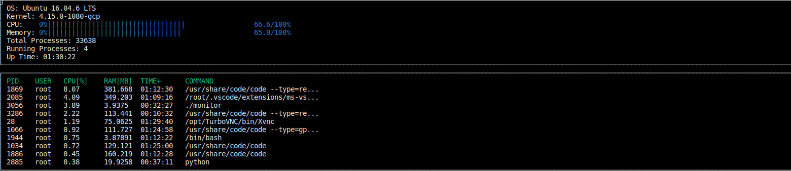

# Capstone Project

This Capstone Project is based on the third project of the udacity C++ Nano-degree. I choosed to upgrade my Project [System Monitor Application](https://github.com/abdulkarim723/System-Monitor-Application/tree/e6e802dda9ae2f244970a3340c1784b6703570ba) from single thread application to a multithreaded application.

## Needed Libraries

Needed Libraries from outside the standard library is only ncurses. On Ubuntu one can by the following command install the ncurses on your Linux system
```
sudo apt-get install libncurses5-dev libncursesw5-dev
```
## Workflow
- clone the repository  
```
git clone  https://github.com/abdulkarim723/System-Monitor-Application.git  
```
- install ncurses on your local system  
```
sudo apt install libncurses5-dev libncursesw5-dev
```
- go inside the downloaded folder  
```
cd System-Monitor-Application/
```
- Build the application  
```
make build
```
- run the application  
```
sudo ./monitor
```

## How does the Program work
- **Up Arrow Key** scrolls the list of processes upwards
- **Down Arrow Key** scrolls the list in the other direction
- **Right Arrow Key** exits the program

## Program and class structure and accomplished Criteria
- Program structure is based on the project memory based application. 
- The program accepts user input and process it in the function **Display()** in the file ncurses_display.cpp and it's header file
- A data structure is called **processStruct** which stores all information about a single process, is created in the file process.h and used as a member variable in the class **Process**. Composition concept is used here. A Process has a data strucutre which hold it's information
- This member variable is called **data_** and is managed by a unique pointer. So, data managed by the unique pointer is stored in the heap memory 
- In the class System, the member variable **processes_** is changed from reference value to a vector of processes and then passed using move semantics to several thread by it's move constructor in the function **DisplayProcesses()** in line 113 in the file ncurses_display.cpp
- Rule of five is applied on the class **Process** as we need to use the move constructor to pass process data to the Threads as mentioned in the preceding point
- The program is changed to a multithreaded program where every process member variable is passed to a thread using **std::async**
- The function **LineDisplay()** is used to process the data of a single process. Every process is passed to a thread and then it's data is printed on the screen. A mutex variable and lock_guard are used in the function to prevent concurrent data write to the screen at the same time 
- The featue std::async is used with the function **Processor::Utilization()** with std::future which encapsulates the future and promise feature.
As a result, something similar to the following is shown on the terminal

